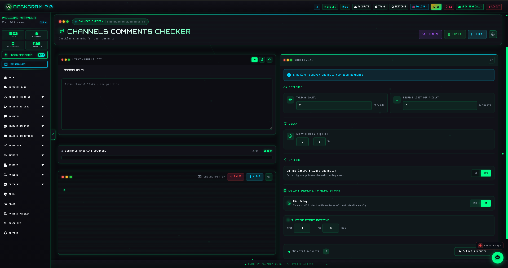
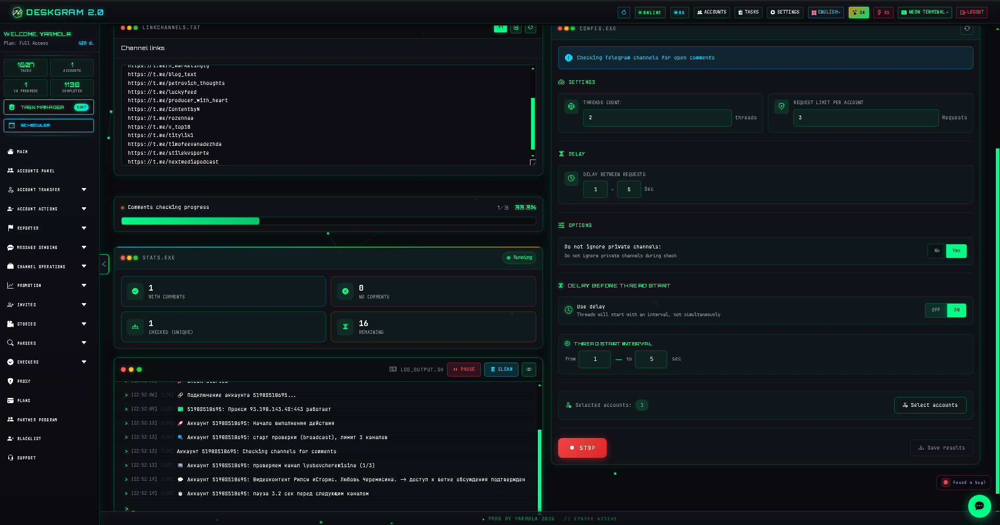
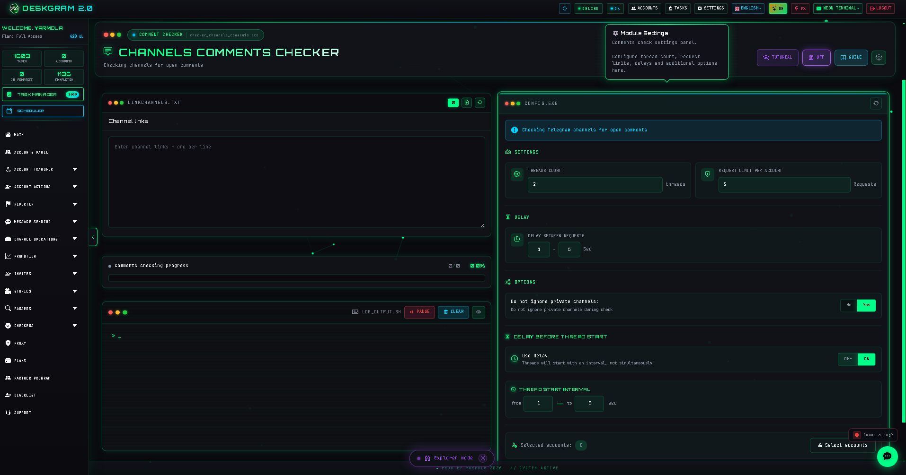
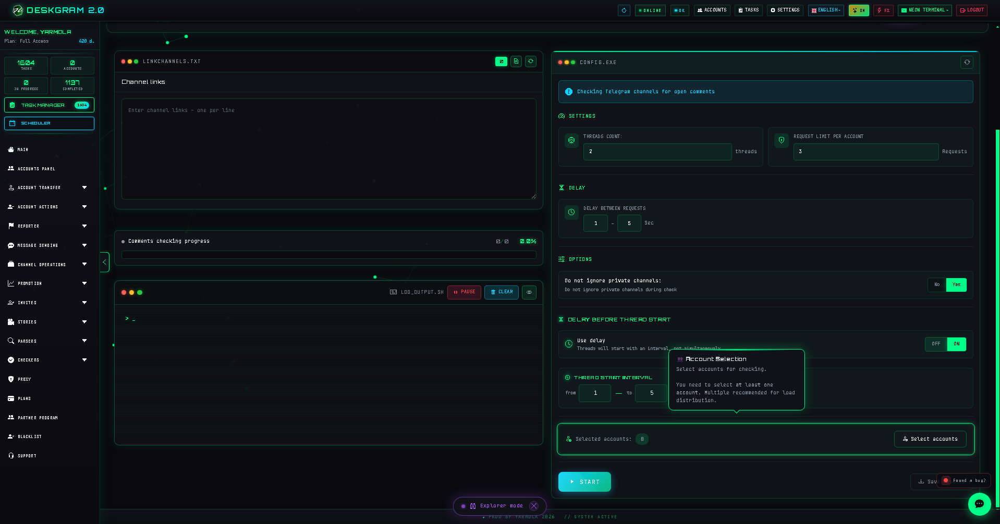

# Telegram Channel Comments Checker with Deskgram 2

Telegram Channel Comments Checker in Deskgram 2 helps identify channels with open comments before you move into commenting, parser, or community engagement routes. The module is useful when you need a faster screening layer instead of manually opening each channel one by one.

[Deskgram 2 Hub](https://github.com/Deskgram-2/deskgram-2-telegram-automation-en) · [Website](https://deskgram2.com/) · [Telegram Bot](https://t.me/DG2welcomebot) · [Web Preview](https://deskgram2.com/web-preview?path=%2Fapp-demo%2F&lang=en)

## Interactive Web Preview

Try the module interface in the browser: [Open web preview](https://deskgram2.com/web-preview?path=%2Fapp-demo%2Ffunctions%2Fchecker_channels_comments&lang=en)

This makes it easy to inspect filters, account assignment, and statistics before running the check at scale.

## Screenshots

## About the module

| Parameter | What is inside |
|---|---|
| Main task | Screening Telegram channels for open comments before engagement |
| Important blocks | Main list, settings, statistics, account assignment |
| Useful for | Comment marketing, community discovery, parser preparation |
| Related sections | Neuro Commenting, Comment Audience Parser, Channel Search |

## What it can do

- check channels for open comments before the next engagement step;
- reduce manual screening work across larger channel lists;
- help filter candidate channels for commenting or audience collection;
- keep statistics visible during the screening run;
- support more stable planning before community-focused routes.

## Quick start

1. Load the channel list you want to inspect.
2. Configure limits, timing, and account settings.
3. Run the checker and wait for the result summary.
4. Filter channels with open comments.
5. Move the validated set into the next comment-focused module.

## Where this module fits best

- [Neuro Commenting](https://github.com/Deskgram-2/telegram-neuro-commenting-deskgram-en), if the next step is comment-based engagement;
- [Comment Audience Parser](https://github.com/Deskgram-2/telegram-comment-audience-parser-deskgram-en), if you want to collect audiences around comment-enabled communities;
- [Channel Search](https://github.com/Deskgram-2/telegram-channel-search-deskgram-en), if you are combining discovery with comment availability checks;
- [Task Manager](https://github.com/Deskgram-2/telegram-task-manager-deskgram-en), if the check should stay inside a repeatable workflow.

## When it is especially useful

- when a channel list needs comment-availability screening first;
- when comment marketing routes should start from validated communities;
- when parser logic depends on whether comments are open;
- when manual checking would be too slow for the list size.

## What to choose: comments checker or direct neuro commenting

| If your goal is | Better fit |
|---|---|
| Screen channels before engagement | `Channel Comments Checker` |
| Start commenting in already validated communities | [Neuro Commenting](https://github.com/Deskgram-2/telegram-neuro-commenting-deskgram-en) |
| Build a cleaner list of comment-enabled channels | `Channel Comments Checker` |
| Execute the engagement layer right away | `Neuro Commenting` |

## Related repositories

- [Deskgram 2 Hub](https://github.com/Deskgram-2/deskgram-2-telegram-automation-en)
- [Neuro Commenting](https://github.com/Deskgram-2/telegram-neuro-commenting-deskgram-en)
- [Comment Audience Parser](https://github.com/Deskgram-2/telegram-comment-audience-parser-deskgram-en)
- [Channel Search](https://github.com/Deskgram-2/telegram-channel-search-deskgram-en)
- [Task Manager](https://github.com/Deskgram-2/telegram-task-manager-deskgram-en)

## FAQ

### Can I inspect the module before installing anything?

Yes. The browser preview already shows the main checker layout, settings, statistics, and account block.

### Is this only for commenting campaigns?

No. It is also useful when parser or community discovery routes depend on whether comments are open.
